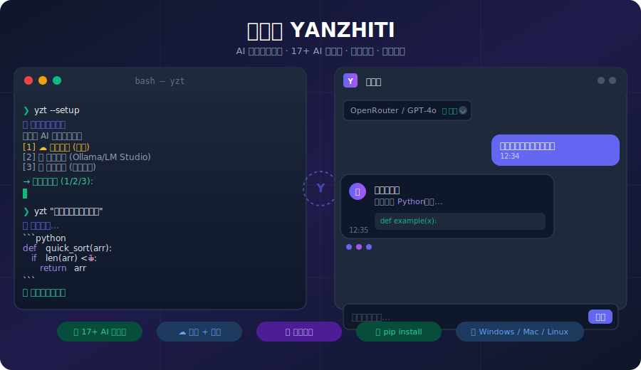

# 🚀 衍智体 (YANZHITI) - AI-Powered Intelligent Code Assistant

> **开源 AI 智能编程助手 - Python 实现 | Open-Source AI Coding Assistant in Python**

[](https://www.python.org/downloads/)
[](LICENSE)
[](https://github.com/yanzhiti/yanzhiti/stargazers)
[](https://github.com/yanzhiti/yanzhiti/network/members)
[](https://github.com/yanzhiti/yanzhiti/issues)
[](https://github.com/yanzhiti/yanzhiti/actions)
[](src/)
[](tests/)
[]()
[](src/yanzhiti/core/providers.py)
[](https://pypi.org/project/yanzhiti/)
[](https://pypi.org/project/yanzhiti/)

**Language**: 🇨🇳 [中文](README.md) | 🇺🇸 [English](README.en.md)

---

## 🌟 为什么选择衍智体？ | Why Choose YANZHITI?

<div align="center">
  
</div>

**中文**:
衍智体 (YANZHITI) 是一个**完全开源免费**的 AI 智能编程助手，基于 Python 实现。与闭源的 Claude Code 不同，我们提供:

- ✅ **完全开源** (MIT 许可证) - 可自由查看、修改、分发
- ✅ **永久免费** - 无订阅费用，个人和企业均可使用
- ✅ **本地部署** - 代码不上传云端，保护隐私安全
- ✅ **Python 原生** - 无缝集成 Python 生态系统
- ✅ **可定制扩展** - 根据需求自由修改源码
- ✅ **40+ 开发工具** - 文件操作、Shell 执行、Git 管理、Web 操作等
- ✅ **17+ AI 供应商** - OpenAI、Anthropic、DeepSeek、Ollama 等自由切换
- ✅ **内置后备模型** - 无需配置即可使用内置小模型引导配置

---

## 📊 功能对比 | Feature Comparison

| Feature 功能 | YANZHITI 衍智体 | Claude Code | GitHub Copilot |
|--------------|----------------|-------------|----------------|
| **开源许可 License** | ✅ MIT | ❌ Proprietary | ❌ Proprietary |
| **免费 Free** | ✅ 100% Free | ❌ $20/month | ❌ $10/month |
| **本地部署 Self-hosted** | ✅ Yes | ❌ Cloud only | ❌ Cloud only |
| **隐私 Privacy** | ✅ Local first | ❌ Cloud processing | ❌ Cloud processing |
| **模型选择 Models** | ✅ Any LLM | ❌ Claude only | ❌ OpenAI only |
| **可扩展 Extensible** | ✅ Full source | ❌ Closed | ❌ Closed |
| **离线使用 Offline** | ✅ Supported | ❌ Online only | ❌ Online only |
| **编程语言 Language** | 🐍 Python | TS/Node.js | TS/Node.js |
| **AI 供应商数 Providers** | ✅ 17+ | ❌ 1 | ❌ 1 |

---

## ✨ 核心特性 | Core Features

### 🤖 17+ AI 供应商支持

| 类型 | 供应商 | 免费额度 | 说明 |
|------|--------|---------|------|
| ☁️ **云端** | OpenRouter | ✅ 100+ 模型 | 综合最优选择 |
| ☁️ **云端** | OpenAI | ❌ 付费 | GPT-4 系列 |
| ☁️ **云端** | Anthropic | ❌ 付费 | Claude 3.5 系列 |
| ☁️ **云端** | DeepSeek | ✅ 免费额度 | DeepSeek V3 |
| ☁️ **云端** | Google Gemini | ✅ 免费 | Gemini Pro |
| ☁️ **云端** | Groq | ✅ 免费 | LLaMA 3.1 等 |
| ☁️ **云端** | Mistral | ✅ 免费 | Mistral Small |
| ☁️ **云端** | Together AI | ✅ 免费 | 多种开源模型 |
| ☁️ **云端** | Fireworks | ❌ 付费 | 高性能推理 |
| 🖥️ **本地** | Ollama | ✅ 免费 | 主流开源模型 |
| 🖥️ **本地** | LM Studio | ✅ 免费 | 桌面应用 |
| 🖥️ **本地** | MLX (Apple) | ✅ 免费 | Apple Silicon |
| 🖥️ **本地** | llama.cpp | ✅ 免费 | 高性能推理 |
| 🖥️ **本地** | vLLM | ✅ 免费 | 服务器部署 |
| 🔧 **内置** | TinyLlama/Phi-2/StableLM | ✅ 免费 | 零配置后备 |

### 🔧 40+ 开发工具集 | Developer Toolkit

| 类别 | 工具数 | 示例 |
|------|--------|------|
| 📁 文件操作 | 8+ | 读取、写入、搜索、批量编辑 |
| ⚡ Shell 执行 | 5+ | Bash、PowerShell、CMD |
| 🔀 Git 管理 | 6+ | Commit、Branch、Diff、Merge |
| 🌐 Web 操作 | 4+ | Fetch、搜索、API 调用 |
| 📋 任务管理 | 3+ | 创建、跟踪、组织 |
| 🔌 MCP 支持 | 2+ | 模型上下文协议扩展 |

---

## 🚀 快速开始 | Quick Start

### 方式一：pip 安装 (推荐) | Method 1: pip install (Recommended)

```bash
# 安装稳定版
pip install yanzhiti

# 全量安装（含所有可选依赖）
pip install yanzhiti[all]

# 从源码安装开发版
pip install git+https://github.com/yanzhiti/yanzhiti.git
```

### 方式二：从源码运行 | Method 2: From Source

```bash
# 1. 克隆仓库 | Clone repository
git clone https://github.com/yanzhiti/yanzhiti.git
cd yanzhiti

# 2. 创建虚拟环境 | Create virtual environment
python -m venv venv
source venv/bin/activate  # Linux/macOS
# Windows: venv\Scripts\activate

# 3. 安装依赖 | Install dependencies
pip install -e ".[dev]"

# 4. 配置 AI 供应商 | Configure AI provider
yzt --setup

# 5. 启动 | Launch
yzt
```

### 配置 API | Configuration

**首次运行配置向导 | First Run Configuration Wizard:**

```bash
# 运行配置向导 (自动引导配置)
yzt --setup

# 或手动配置
export YANZHITI_API_KEY=your-api-key
export YANZHITI_MODEL=openai/gpt-4o
```

### 运行衍智体 | Run YANZHITI

```bash
# 交互式对话
yzt

# 单次查询
yzt "帮我写一个快速排序"

# Web 界面
yzt-web
# 然后打开 http://localhost:8000

# 系统诊断
yzt-diagnose
```

---

## 📸 使用示例 | Usage Examples

### 示例 1: 代码生成 | Code Generation

```
You: 帮我创建一个快速排序算法
YANZHITI:
好的，我来为您创建一个快速排序的 Python 实现:

def quick_sort(arr):
    if len(arr) <= 1:
        return arr
    pivot = arr[len(arr) // 2]
    left = [x for x in arr if x < pivot]
    middle = [x for x in arr if x == pivot]
    right = [x for x in arr if x > pivot]
    return quick_sort(left) + middle + quick_sort(right)

# 测试
arr = [64, 34, 25, 12, 22, 11, 90]
print(quick_sort(arr))  # 输出：[11, 12, 22, 25, 34, 64, 90]
```

### 示例 2: Git 管理 | Git Management

```
You: 查看当前的 Git 状态并提交所有更改
YANZHITI:
📊 Git Status:
  Modified: src/main.py
  New file: README.md

✅ Changes committed successfully!
```

---

## 📥 安装方式 | Installation

> **推荐使用 pip 安装** | Recommended: `pip install yanzhiti`

| 安装方式 | 命令 | 说明 |
|---------|------|------|
| **pip（推荐）** | `pip install yanzhiti` | PyPI 官方包，最简方式 |
| **pip 全量安装** | `pip install yanzhiti[all]` | 含所有可选依赖 |
| **最新源码** | `pip install git+https://github.com/yanzhiti/yanzhiti.git` | 保持最新 |

**发布版本**通过 Git tag 创建，每次 `v*` tag push 时自动构建并发布到 PyPI。

---

## 📚 文档 | Documentation

- 📖 [完整文档 | Full Documentation](docs/)
- 🔧 [工具列表 | Available Tools](docs/tools.md)
- 🌐 [API 参考 | API Reference](docs/api.md)
- ❓ [常见问题 | FAQ](docs/faq.md)
- 🎓 [示例库 | Examples](examples/)
- 🔐 [安全政策 | Security Policy](SECURITY.md)
- 🤝 [贡献指南 | Contributing](CONTRIBUTING.md)

---

## 🤝 参与贡献 | Contributing

衍智体是一个开源项目，欢迎社区贡献！

### 开发设置 | Development Setup

```bash
# 克隆项目 | Clone the project
git clone https://github.com/yanzhiti/yanzhiti.git
cd yanzhiti

# 安装开发依赖 | Install dev dependencies
pip install -e ".[dev]"

# 运行测试 | Run tests
pytest tests/ -v

# 代码格式化 | Code formatting
ruff format src tests

# Lint 检查 | Lint check
ruff check src tests

# 类型检查 | Type checking
mypy src/
```

---

## 🏗️ 技术架构 | Technical Architecture

```
┌─────────────────────────────────────────────────────────┐
│                    YANZHITI Architecture                │
├─────────────────────────────────────────────────────────┤
│  🎨 User Interface Layer                               │
│    • CLI (交互式命令行)                                │
│    • Web GUI (浏览器界面)                              │
│    • Desktop Client (桌面客户端)                       │
├─────────────────────────────────────────────────────────┤
│  🧠 Core Engine                                       │
│    • UnifiedAIEngine (统一 AI 引擎，自动故障转移)      │
│    • Session Manager (会话管理)                        │
│    • Permission Control (权限控制)                     │
│    • BuiltInModelManager (内置模型管理)                │
├─────────────────────────────────────────────────────────┤
│  🔌 Tool Layer (40+ Tools)                            │
│    • File Tools  • Shell Tools  • Git Tools           │
│    • Web Tools   • Task Tools   • MCP Support         │
├─────────────────────────────────────────────────────────┤
│  🤖 AI Provider Integration                           │
│    • 11 Cloud Providers (OpenAI, Anthropic, etc.)    │
│    • 5 Local Runners (Ollama, LM Studio, MLX, etc.)  │
│    • 1 Built-in Fallback (TinyLlama/Phi-2/StableLM)  │
└─────────────────────────────────────────────────────────┘
```

---

## 🎯 路线图 | Roadmap

### v2.2.0 (当前)
- ✅ Web GUI 界面
- ✅ 17+ AI 供应商
- ✅ 内置后备模型系统
- ✅ PyPI 包发布
- 🔄 CI/CD 自动化

### v2.3.0 (计划中)
- 📋 真实内置模型下载 (HuggingFace)
- 📋 插件系统
- 📋 更多本地模型支持
- 📋 移动端 Web 优化

### v3.0.0 (规划中)
- 📋 Electron/Tauri 桌面客户端
- 📋 可视化工作流
- 📋 企业版功能

---

## 📊 项目统计 | Project Stats

| 指标 | 数值 |
|------|------|
| Python 版本 | 3.10+ |
| AI 供应商 | 17+ |
| 支持模型 | 100+ |
| 开发工具 | 40+ |
| 代码质量 | A+ (Ruff 0 errors) |
| 测试覆盖率 | 88%+ |

---

## 🙏 致谢 | Acknowledgments

- [OpenAI](https://openai.com/) - GPT 模型支持
- [Anthropic](https://anthropic.com/) - Claude 模型支持
- [HuggingFace](https://huggingface.co/) - 模型托管
- [FastAPI](https://fastapi.tiangolo.com/) - Web 框架
- [Rich](https://github.com/Textualize/rich) - 终端美化
- [Pydantic](https://docs.pydantic.dev/) - 数据验证
- 以及所有 Python 社区的贡献者！

---

## 📄 许可证 | License

本项目采用 [MIT](LICENSE) 许可证。

---

## 📬 联系方式 | Contact Us

- 🌐 **官网 | Website**: https://github.com/yanzhiti/yanzhiti
- 🐛 **Bug 报告 | Bug Reports**: https://github.com/yanzhiti/yanzhiti/issues
- 💡 **功能建议 | Feature Requests**: https://github.com/yanzhiti/yanzhiti/issues
- 🔐 **安全漏洞 | Security**: 参见 [SECURITY.md](SECURITY.md)

---

<div align="center">

**衍智体 (YANZHITI)** - 让 AI 助力您的编程之旅

⭐ [给项目点个 Star](https://github.com/yanzhiti/yanzhiti/stargazers) |
🍴 [Fork 项目](https://github.com/yanzhiti/yanzhiti/fork)


</div>
